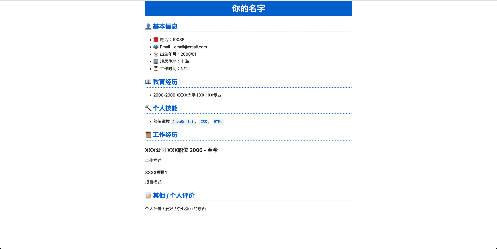
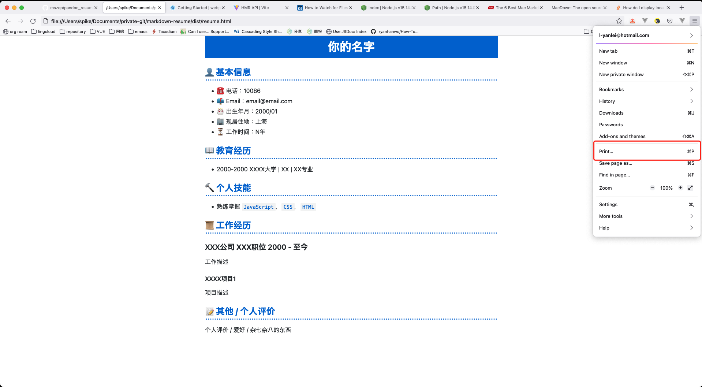
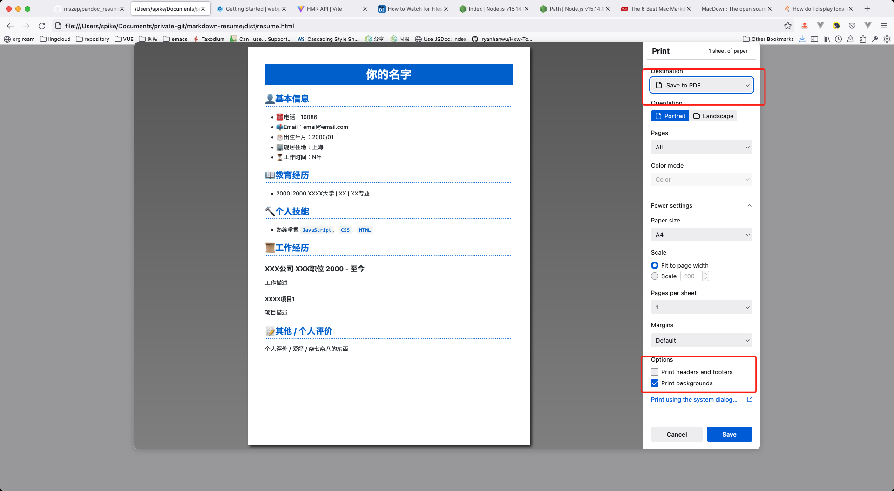

# Get Started

## 为什么要用 Markdown 写简历
- Markdown 是当前编写文档比较通用的一种格式
- 可以使用自己喜欢的编辑器编写
- 可以使用 Git 管理起来，可以翻看自己不同时期的简历

## 原理
- 利用 [marked](https://github.com/markedjs/marked) 将写好的 Markdown 转化为 HTML
- 使用一些额外的 HTML 标签，将 Markdown 转化的 HTML 包裹起来，加上类名，引入样式
- 通过修改 HTML 的样式，实现各种效果，理论上你能用 HTML + CSS 实现的样式，你都可以应用到简历上
- 再利用浏览器的打印功能，保存为 PDF

## 优点
- 简单，你只需要写一份 Markdown 的简历，写点样式，就能得到一份看着简洁美观的简历；因为简单，也方便你随意地定制化
- 不需要太多额外的依赖，由于是利用浏览器打印功能保存 PDF，所以只要有浏览器就可以了，不需要额外安装的转换 PDF 的依赖, 也不用考虑转化时出现的一些样式丢失问题

## 运行
```bash
git clone https://github.com/Spike-Leung/markdown-resume.git

cd markdown-resume

yarn # 安装依赖

vim markdown/resume.md # 编辑你的简历

yarn build # 生成html文件
```

## 简历编辑
- 你可以直接编辑 `markdown` 目录下的 `resume.md` 文件
- 或者你可以自己在任意位置创建一个 `.md` 文件，然后在 `markdown-resume/config/index.js` 中，修改 `resume-path` 指向你的 `.md` 文件

## 导出 PDF
尝试使用一些模块完成 PDF 的导出，但样式差异较大，目前的解决办法是使用浏览器的打印功能，然后将其保存到本地。

以 firefox 为例：

- 打开生成的 html 文件
- 选择打印

- 配置打印选项
  - 选择保存为PDF
  - 勾选打印背景
  - 去除页眉页脚

- 保存

## 修改样式
- 所有的样式都定义在 `style` 文件夹中，你可以打开 HTML 文件后，找到对应的元素，编写 CSS，添加到对应的 CSS 文件中
- 或者你可以新增自己的 CSS 文件， 然后引入到 `style/index.css` 中

## 其他定制化
- 你可以通过 [markdown-it](https://github.com/markdown-it/markdown-it) 扩展 Markdown 的语法，使其支持 Emoji 等额外的功能

## Q&A
### 导出 PDF 后， Emoji消失了
目前测试下来，firefox 导出是消失了，Chrome可以正常导出，所以如果你用了 Emoji，就用 Chrome 进行导出吧。

# 参考
- [Complete list of github markdown emoji markup](https://gist.github.com/rxaviers/7360908)
- [pandoc_resume](https://github.com/mszep/pandoc_resume)
